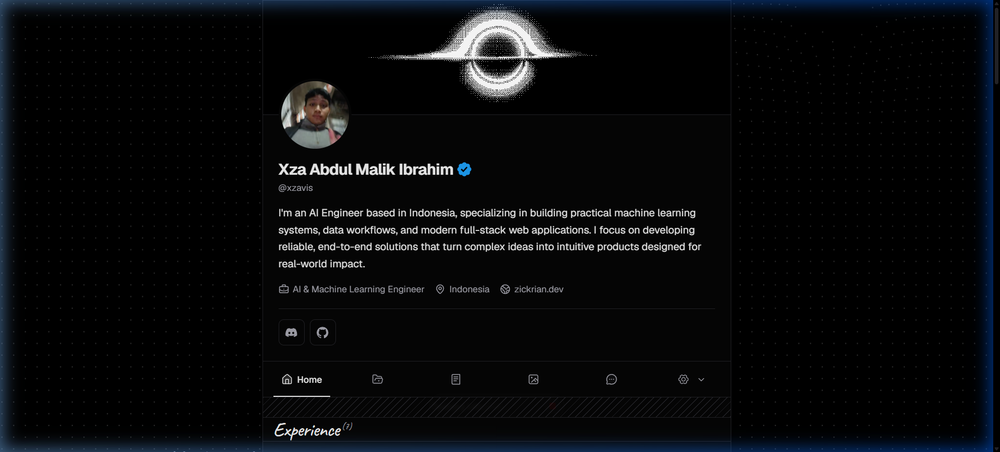
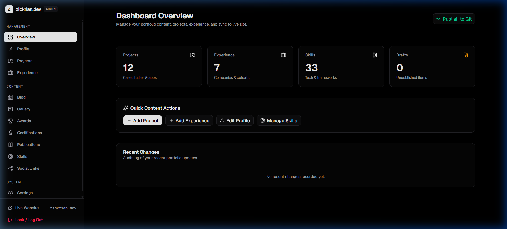

# ⚡ PortoCMS — Modern Developer Portfolio & Local-first Admin CMS

<div align="center">

> A high-performance, dark-mode developer portfolio template featuring a built-in **Local-first File-based Admin CMS (PortoCMS)**, streaming AI assistant, and context-aware media management.

[](https://opensource.org/licenses/MIT)
[](https://nextjs.org/)
[](https://react.dev/)
[](https://tailwindcss.com/)
[](https://www.typescriptlang.org/)
[](./QA_TESTING.md)

[**Read PRD Spec →**](./PRD.md) • [**QA Testing Plan →**](./QA_TESTING.md) • [**Architecture Handover →**](./HANDOVER.md)

---

### 🎬 Walkthrough Demo


</div>

---

## 📸 Antarmuka & Showcase

| 🌐 Public Portfolio (Frontend) | 🛠️ Internal Admin CMS (`/admin`) |
|:---:|:---:|
|  |  |
| *Hero banner video WebM, streaming AI assistant widget, dynamic project showcase & GitHub activity.* | *Panel CMS mandiri tanpa database eksternal: edit profil, kelola proyek, reorder urutan, & Media Library.* |

---

## ✨ Fitur Unggulan

### 1. 🛠️ Built-in Local-first Admin CMS (No External DB Needed!)
- **Zero-Config Database**: Tidak memerlukan setup PostgreSQL, MongoDB, atau langganan Headless CMS berbayar. Seluruh data tersimpan dalam bentuk file kanonikal JSON di `/content/**/*.json`.
- **Media Library Terpadu**: Modal galeri media dengan upload terarah (`/logos/`, `/projects/[slug]/`, `/image/`) dan proteksi **deduplikasi otomatis** agar disk hemat dan bersih.
- **Git Commit & Auto Deploy**: Tombol *Publish to Git* langsung dari dashboard admin untuk commit perubahan konten dan memicu deploy otomatis di Vercel.
- **PIN Protected**: Akses aman ke `/admin` berproteksi PIN rahasia.

### 2. 🚀 Modern Public Portfolio
- **AI Chat Widget (Streaming)**: Asisten AI cerdas berbasis Groq Cloud SDK yang memahami riwayat profil, pengalaman, dan teknologi pengguna secara mendalam.
- **Bilingual Switcher (ID / EN)**: Dukungan multi-bahasa instan (Indonesia ⇄ English) di seluruh konten situs.
- **Media & Galeri Interaktif**: Banner video WebM looping autoplay, lightbox galeri foto proyek, dan audio haptic feedback.
- **Contact Form Pintar**: Formulir terintegrasi Resend API disertai opsi perapian pesan otomatis dengan AI.
- **Live Integrations**: Grafik kontribusi GitHub live, tautan Medium RSS, dan showcase sertifikasi.

---

## 🚀 Panduan Memulai Cepat (Quick Start)

### Prasyarat
- **Node.js** ≥ 22
- **pnpm** ≥ 9 (atau npm/yarn)

### 1. Clone & Instalasi
```bash
# Clone repository
git clone https://github.com/yourusername/portocms-portfolio-template.git
cd portocms-portfolio-template

# Install dependencies
pnpm install

# Setup environment variables
cp .env.example .env.local
```

### 2. Konfigurasi `.env.local`
Isi kredensial API gratis berikut:
```env
# Diperlukan untuk AI Chat Widget & Polishing Email (Gratis di groq.com)
GROQ_API_KEY=gsk_your_groq_key

# Diperlukan untuk Pengiriman Email Kontak (Gratis di resend.com)
RESEND_API_KEY=re_your_resend_key

# URL domain aplikasi Anda
APP_URL=http://localhost:3000
```

### 3. Jalankan Dev Server & Akses CMS
```bash
pnpm dev
```
- **Website Publik**: Buka [http://localhost:3000](http://localhost:3000)
- **Admin CMS Dashboard**: Buka [http://localhost:3000/admin](http://localhost:3000/admin)
  - **Default Passphrase**: `admin2026` *(Dapat disesuaikan via `ADMIN_PIN` atau `ADMIN_PASSWORD` di `.env.local`)*

---

## 📁 Struktur Arsitektur Data (Single Source of Truth)

```
xzavis/
├── content/                     # Canonical JSON Content (Single Source of Truth)
│   ├── profile.json             # Biodata, headline, sosmed
│   ├── projects/                # Proyek individual & order.json
│   ├── experience.json          # Riwayat pekerjaan
│   ├── education.json           # Riwayat pendidikan
│   ├── skills.json              # Daftar keahlian & kategori
│   └── certifications.json      # Sertifikasi & lisensi
├── public/                      # Asset Storage (Contextual Mapping)
│   ├── logos/                   # Logo perusahaan & institusi sertifikat
│   ├── projects/[slug]/         # Asset khusus galeri & hero proyek
│   ├── image/                   # Foto profil & ilustrasi umum
│   └── demo-walkthrough.webp    # Rekaman video demo CMS
├── src/
│   ├── app/(app)/               # Public Frontend Pages (Server Components)
│   ├── app/admin/               # Admin CMS Dashboard Pages
│   ├── features/admin/          # Server Actions & Content Manager Mutators
│   └── lib/content/             # JSON Content Repository & Loaders
├── PRD.md                       # Product Requirements Document
├── HANDOVER.md                  # Ringkasan Arsitektur & Operasional
└── QA_TESTING.md                # Quality Assurance & TestSprite Test Matrix
```

---

## 🧪 Pengujian & Penjaminan Mutu (QA)

Project ini dilengkapi dengan standarisasi pengujian otomatis dan manual:
- **TestSprite E2E AI Testing**: Skenario perjalanan pengguna otomatis dan verifikasi UI.
- **Vitest Unit Testing**: Pengujian fungsi atomik content repository dan manipulasi data JSON.

```bash
pnpm test          # Menjalankan unit tests dengan Vitest
pnpm check-types   # Validasi TypeScript
pnpm lint          # Pemeriksaan kualitas kode ESLint
testsprite test run --all # Menjalankan automated test E2E TestSprite
```

---

## 🤝 Attribution & Acknowledgments

This template is built upon the clean aesthetics and layout originally designed by **[zickrian.dev](https://www.zickrian.dev)**. The local-first CMS engine, modular architecture, and open-source template distribution are developed and maintained by **[xzavis](https://github.com/xzavis)**.

## 📄 Lisensi

Didistribusikan di bawah **Lisensi MIT** standar. Siapa pun dipersilakan untuk menggunakan, memodifikasi, mem-fork, dan menyesuaikan template portofolio & CMS ini untuk portofolio pribadi maupun komersial secara bebas.

Lihat file [LICENSE](./LICENSE) untuk informasi hak cipta lengkap:

```
MIT License
Copyright (c) 2026 PortoCMS Contributors
```
