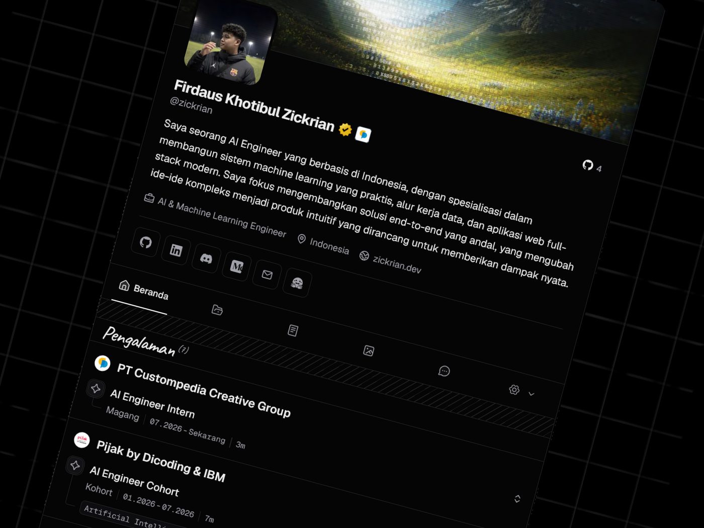
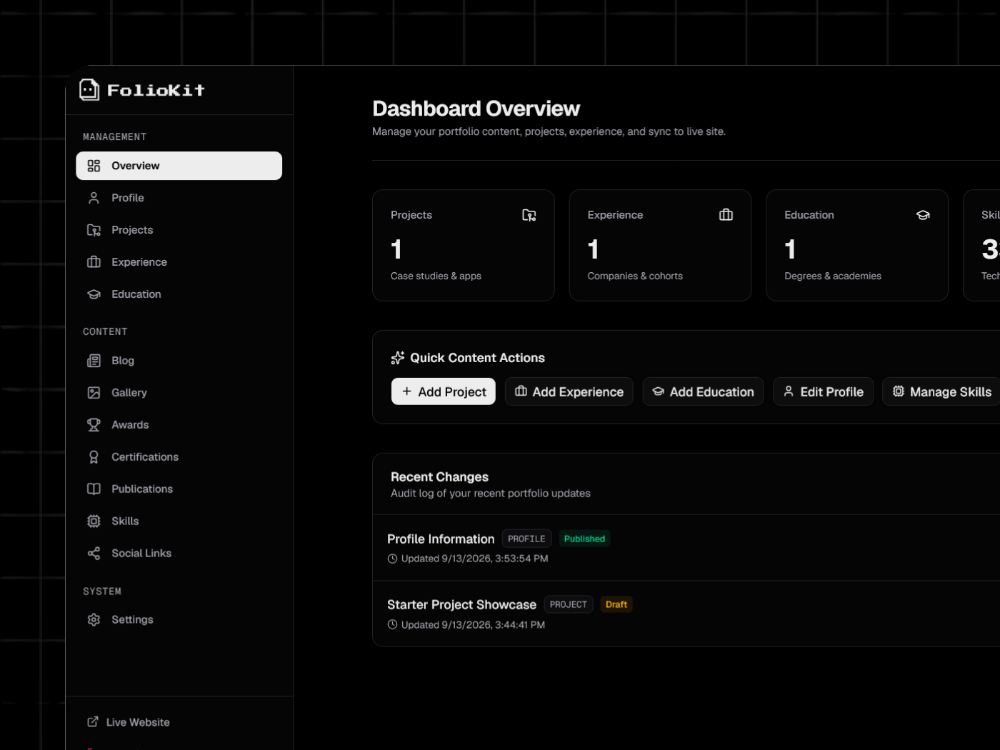

<div align="center">


# FolioKit — Modern Developer Portfolio & Admin CMS

> Platform template portofolio modern untuk developer dan kreator digital. Dirancang agar siapapun bisa membuat, mengelola, dan mempublikasikan portofolio profesional langsung melalui browser atau ponsel pintar tanpa ketergantungan pada database eksternal berbayar.

[](https://opensource.org/licenses/MIT)
[](https://nextjs.org/)
[](https://react.dev/)
[](https://tailwindcss.com/)
[](https://www.typescriptlang.org/)

[**Showcase**](#showcase) • [**Jalur Cepat (Pemula)**](#-jalur-a--bikin-portofolio-dari-browser-tanpa-koding) • [**Fitur Dashboard**](#-fitur-lengkap-dashboard-admin-admin) • [**Jalur Developer**](#-jalur-b--panduan-developer-local-setup) • [**Struktur Data**](#-struktur-arsitektur-data) • [**FAQ**](#-tanya-jawab-faq)

</div>

---

##  Pilih Jalur Anda

```text
                           START HERE
                                │
             ┌──────────────────┴──────────────────┐
             │                                     │
    🟢 JALUR A: PEMULA                   🔵 JALUR B: DEVELOPER
   "Saya cuma mau membuat                "Saya ingin memodifikasi
    dan mengelola portofolio              source code & dev lokal"
             │                                     │
             ▼                                     ▼
     Tanpa Buka VS Code                      Clone & Terminal
   (Bisa langsung dari HP)                  (Node.js & Next.js)
```

---

##  Showcase

###  Halaman Publik (Frontend)



> **Antarmuka Publik:** Hero video looping WebM yang memukau, asisten cerdas AI streaming dengan integrasi Groq Cloud SDK, showcase proyek dinamis, linimasa karier & riwayat pendidikan interaktif, serta grafik kontribusi GitHub secara *live*.

<br />

###  Dashboard Admin (`/admin`)



> **Panel Kontrol Mandiri (*Local-First JSON*):** Kelola seluruh portofolio langsung dari browser tanpa database eksternal. Perbarui biodata dwi-bahasa (ID/EN), kelola proyek & galeri lightbox, atur urutan konten, kelola Media Library cerdas anti-duplikasi, hingga optimasi metadata SEO & OpenGraph.

---

## 🟢 Jalur A — Bikin Portofolio Dari Browser (Tanpa Koding)

Jalur ini ditujukan bagi Anda yang ingin segera memiliki portofolio daring tanpa perlu memasang text editor (VS Code), tanpa terminal, dan dapat dioperasikan penuh melalui browser ponsel atau laptop.

### 1. Salin Template ke Akun GitHub Anda
1. Klik tombol **Use this template** (atau **Fork**) di bagian atas halaman repositori ini.
2. Beri nama repositori Anda (misalnya `my-portfolio`).
3. Pilih opsi **Public** agar situs portofolio dapat diakses publik.

### 2. Hubungkan & Deploy ke Vercel (Gratis)
1. Buka [Vercel.com](https://vercel.com) dan masuk menggunakan akun GitHub Anda.
2. Klik **Add New Project**, lalu pilih repositori yang baru saja Anda buat.
3. Di bagian konfigurasi Environment Variables, masukkan variabel dasar:
   - `APP_URL`: Alamat domain Vercel Anda (atau kosongkan sementara hingga deploy pertama selesai).
   - `ADMIN_PASSWORD`: Buat kata sandi rahasia Anda sendiri untuk masuk ke panel admin (default: `admin2026`).
4. Klik tombol **Deploy** dan tunggu sekitar 1–2 menit hingga situs Anda tayang (*live*).

### 3. Akses Dashboard Admin (`/admin`)
1. Buka tautan situs yang diberikan oleh Vercel, lalu tambahkan `/admin` di belakang URL (contoh: `https://portofolio-anda.vercel.app/admin`).
2. Masukkan kata sandi admin yang telah Anda tentukan.
   > **Catatan Autentikasi:** Saat ini panel admin diproteksi oleh sesi kata sandi aman. Mode autentikasi langsung dengan akun GitHub (*One-click GitHub Sign-In*) sedang dalam tahap pengintegrasian untuk mempermudah sinkronisasi otomatis ke repositori.

### 4. Mulai dari Awal (*Start Fresh*)
Template ini sengaja dilengkapi data contoh agar Anda bisa melihat tampilan utuh portofolio.
- Anda dapat mengedit langsung data profil, proyek, dan pengalaman yang ada, atau menghapus data contoh satu per satu melalui formulir dashboard untuk mengisi karya orisinal Anda.

### 5. Isi Portofolio & Unggah Media
- **Profil**: Perbarui nama lengkap, domisili, tautan sosial, dan deskripsi diri (tersedia dalam bahasa Indonesia dan Inggris).
- **Proyek**: Tambahkan karya terbaik Anda, lengkapi dengan tautan demo langsung, tautan kode sumber, dan pilih ikon teknologi pendukung.
- **Unggah Foto/Video**: Cukup klik tombol upload, pilih foto langsung dari galeri ponsel Anda. Sistem Media Library FolioKit akan menempatkan aset dan menghubungkannya secara otomatis tanpa Anda perlu pusing memikirkan letak file.

---

##  Fitur Lengkap Dashboard Admin (`/admin`)

Dashboard visual FolioKit memberikan kendali penuh terhadap seluruh elemen identitas Anda:

### 1.  Profil & Personal Branding (`/admin/profile`)
- **Identitas Personal**: Nama tampilan, nama pengguna, jabatan/headline, alamat email, dan lokasi.
- **Biografi Dwi-Bahasa (ID & EN)**: Sajikan narasi profil dalam Bahasa Indonesia dan Bahasa Inggris secara berdampingan.
- **Tagline Dinamis (Flip Sentences)**: Kelola teks keahlian bergulir otomatis yang muncul di area hero utama.
- **Avatar & Banner Video**: Unggah foto profil dan video latar belakang looping (WebM) untuk tampilan beranda yang memukau.

### 2.  Manajemen Showcase Proyek (`/admin/projects`)
- **Detail Lengkap Proyek**: Judul, deskripsi, tahun rilis, kategori, tautan demo live, dan URL repositori GitHub.
- **Pemilih Tech Stack**: Sisipkan ikon resmi teknologi (Next.js, React, Tailwind, TypeScript, Docker, PostgreSQL, dll.).
- **Galeri Multi-Foto**: Tambahkan tangkapan layar pendukung untuk fitur pratinjau galeri foto interaktif (*lightbox*).
- **Pengurutan Fleksibel**: Atur urutan proyek unggulan agar tampil paling pertama hanya dengan satu klik.

### 3.  Riwayat Karier & Pekerjaan (`/admin/experience`)
- Catat perjalanan karier, nama institusi, posisi, durasi masa kerja, dan poin-poin pencapaian utama.
- Sematkan logo perusahaan yang otomatis tersinkronisasi ke timeline riwayat kerja.

### 4.  Keahlian & Teknologi (`/admin/skills`)
- Kelompokkan keterampilan berdasarkan rumpun (Frontend, Backend, DevOps, AI, Mobile, atau Tools).
- Lengkapi setiap keterampilan dengan ikon resmi untuk visualisasi yang rapi dan profesional.

### 5.  Sertifikasi & Penghargaan (`/admin/certifications` & `/admin/awards`)
- **Sertifikasi Profesional**: Lisensi keahlian, lembaga penerbit, nomor ID, dan tautan verifikasi kredensial.
- **Penghargaan (Awards)**: Tampilkan pencapaian kompetisi, hackathon, atau rekognisi industri teknologi.

### 6.  Blog & Publikasi Riset (`/admin/blog` & `/admin/publications`)
- Tulis dan kelola artikel langsung di dalam sistem lokal.
- Cantumkan paper, artikel ilmiah, atau publikasi eksternal lengkap dengan tautan bacaan.

### 7.  Galeri Kegiatan Visual (`/admin/gallery`)
- Abadikan momen berbicara di konferensi, lokakarya (*workshop*), atau dokumentasi kegiatan personal disertai takarir (*caption*) dan tanggal.

### 8.  Tautan Media Sosial (`/admin/social-links`)
- Hubungkan akun profil Anda ke GitHub, LinkedIn, X, Instagram, Telegram, Medium, dan platform lainnya.

### 9.  Optimasi SEO & Metadata (`/admin/settings`)
- Sesuaikan Meta Title, deskripsi penelusuran Google (*Meta Description*), kata kunci (*Keywords*), serta banner pratinjau sosial (*OpenGraph Share Card*).

### 10.  Media Library Cerdas & Anti-Duplikasi
- Pengunggahan gambar/video otomatis ditempatkan ke direktori terstruktur (`/logos/`, `/projects/[slug]/`, `/image/`).
- Dilengkapi sistem proteksi deduplikasi otomatis: aset berukuran dan berpiksel sama tidak akan disimpan ganda.

---

##  Keunggulan Frontend Publik

-  **Streaming AI Assistant**: Asisten pintar berbasis Groq Cloud SDK yang mampu berinteraksi langsung dengan pengunjung untuk menjawab pertanyaan seputar pengalaman dan karya Anda.
-  **Pengalih Bahasa Instan (Bilingual ID / EN)**: Dukungan multi-bahasa langsung tanpa memuat ulang halaman.
-  **Formulir Kontak Cerdas**: Terintegrasi dengan Resend API dengan opsi pemoles tata bahasa otomatis menggunakan AI sebelum dikirim.
-  **Live Integrations**: Grafik kontribusi GitHub live dan sindikasi artikel Medium via RSS.
-  **Audio Haptic Feedback**: Efek suara interaksi halus yang memberikan kesan mewah dan responsif.
-  **Desain Gelap Modern**: Palet warna elegan yang nyaman di mata untuk kenyamanan membaca optimal.

---

## 🔵 Jalur B — Panduan Developer (Local Setup)

Bagi pengembang perangkat lunak yang ingin menjalankan proyek di komputer lokal, memodifikasi kode sumber, atau berkontribusi pada pengembangan template:

### Prasyarat Lingkungan
- **Node.js** ≥ 22.0.0
- **pnpm** ≥ 9.0.0 (disarankan) atau npm/yarn

### 1. Kloning Repositori & Pasang Dependensi
```bash
# Kloning repositori
git clone https://github.com/yourusername/portocms-portfolio-template.git
cd portocms-portfolio-template

# Pasang seluruh paket dependensi
pnpm install

# Siapkan file konfigurasi lokal
cp .env.example .env.local
```

### 2. Konfigurasi Environment Variables (`.env.local`)
```env
# Alamat URL aplikasi lokal
APP_URL=http://localhost:3000

# Diperlukan untuk Asisten AI & Polish Pesan (Gratis di groq.com)
GROQ_API_KEY=gsk_your_groq_key

# Diperlukan untuk Pengiriman Formulir Kontak (Gratis di resend.com)
RESEND_API_KEY=re_your_resend_key

# Kata sandi masuk panel /admin lokal (Default: admin2026)
ADMIN_PASSWORD=admin2026
```

### 3. Jalankan Server Pengembangan
```bash
pnpm dev
```
- Situs Publik: [http://localhost:3000](http://localhost:3000)
- Dashboard Admin: [http://localhost:3000/admin](http://localhost:3000/admin) *(Passphrase: `admin2026`)*

---

##  Struktur Arsitektur Data

Seluruh data portofolio disimpan secara lokal dalam format file kanonikal (*Single Source of Truth*):

```
├── content/                     # Data Kanonikal JSON (Penyimpanan Konten Mandiri)
│   ├── profile.json             # Biodata, kontak, headline, biografi dwi-bahasa
│   ├── settings.json            # Konfigurasi SEO, kata kunci, & OpenGraph
│   ├── skills.json              # Kelompok keahlian & ikon teknologi
│   ├── experiences/             # Riwayat karier per entri & order.json
│   ├── projects/                # Proyek individual & order.json
│   ├── certifications.json      # Sertifikat profesional & kredensial
│   ├── awards.json              # Penghargaan & pencapaian kompetisi
│   ├── blog.json                # Artikel tulisan lokal
│   ├── gallery.json             # Galeri foto kegiatan & momen
│   ├── publications.json        # Publikasi ilmiah & jurnal
│   └── social-links.json        # Tautan media sosial
├── public/                      # Penyimpanan Berkas Statis & Media
│   ├── logos/                   # Logo perusahaan & institusi
│   ├── projects/[slug]/         # Tangkapan layar galeri proyek
│   ├── image/                   # Foto profil & visual umum
│   ├── mockup-portfolio.png     # Visual mockup antarmuka publik
│   └── mockup-admin.png         # Visual mockup dashboard admin
└── src/
    ├── app/(app)/               # Halaman Publik (Next.js Server Components)
    ├── app/admin/               # Antarmuka Dashboard Admin CMS
    ├── features/admin/          # Server Actions & Logika Mutasi File
    └── lib/content/             # JSON Content Repository & Schema Loaders
```

---

##  Perintah Pengembangan (Scripts)

| Perintah | Deskripsi |
|---|---|
| `pnpm dev` | Menjalankan server pengembangan lokal dengan fitur fast-refresh |
| `pnpm build` | Mengompilasi dan mengoptimasi aplikasi untuk rilis produksi |
| `pnpm start` | Menjalankan build produksi secara lokal |
| `pnpm test` | Menjalankan unit tests dengan Vitest |
| `pnpm check-types` | Memeriksa kepatuhan tipe data TypeScript (`tsc --noEmit`) |
| `pnpm lint` | Memeriksa kualitas dan standar penulisan kode dengan ESLint |

---

##  Tanya Jawab (FAQ)

<details>
<summary><b>Apakah saya bisa mengelola portofolio ini lewat HP?</b></summary>
<p>Ya! Dashboard <code>/admin</code> dirancang responsif dan fleksibel. Anda dapat membuka dashboard dari browser ponsel (seperti Safari atau Chrome), mengisi formulir, dan mengunggah foto langsung dari galeri kamera Anda.</p>
</details>

<details>
<summary><b>Apakah saya perlu menyiapkan database seperti PostgreSQL atau MongoDB?</b></summary>
<p>Tidak sama sekali. FolioKit menggunakan arsitektur <i>Local-first JSON</i>. Seluruh data disimpan langsung dalam bentuk berkas JSON di repositori proyek Anda, sehingga Anda terbebas dari biaya dan kerumitan konfigurasi database cloud.</p>
</details>

<details>
<summary><b>Apakah saya wajib bisa koding untuk memakai FolioKit?</b></summary>
<p>Tidak. Cukup ikuti <b>Jalur A</b>. Anda hanya perlu menyalin template ke GitHub, menghubungkannya ke Vercel, lalu mengelola seluruh konten secara visual melalui dashboard admin di browser.</p>
</details>

<details>
<summary><b>Di mana gambar dan video yang saya unggah akan disimpan?</b></summary>
<p>Aset otomatis diarahkan ke folder <code>public/</code> dengan pengelompokan yang rapi dan terisolasi sesuai peruntukannya (misal aset proyek di <code>public/projects/[slug]/</code>).</p>
</details>

---

##  Attribution & Acknowledgments

Desain antarmuka dan estetika situs ini terinspirasi dari tata letak orisinal oleh **[zickrian.dev](https://www.zickrian.dev)**. Sistem CMS lokal (*PortoCMS*), modularitas arsitektur, dan paket template portofolio didistribusikan serta dikelola oleh **[xzavis](https://github.com/xzavis)**.

##  Lisensi

Didistribusikan di bawah **Lisensi MIT**. Bebas digunakan, dimodifikasi, dan disesuaikan untuk portofolio pribadi maupun kebutuhan komersial secara bebas.

Lihat berkas [LICENSE](./LICENSE) untuk informasi hak cipta lengkap.
